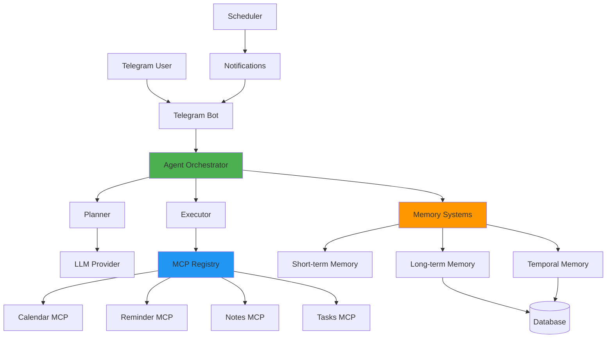
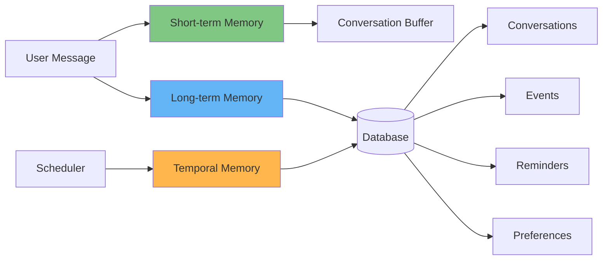
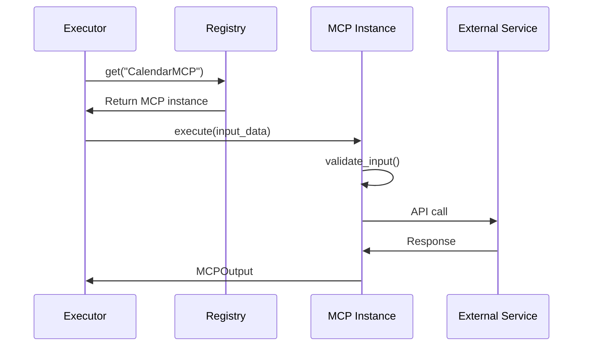
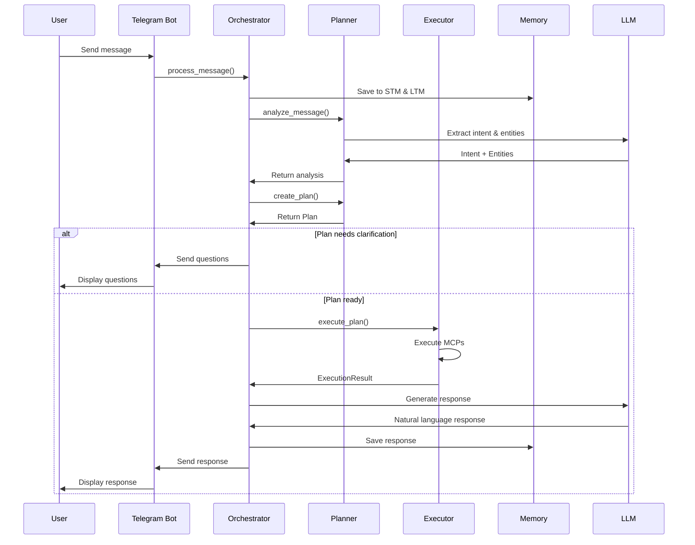

# System Architecture - Agentic AI Personal Assistant

## Overview

This document provides a detailed technical overview of the Agentic AI Personal Assistant architecture, design decisions, and implementation details.

## Table of Contents

1. [System Architecture](#system-architecture)
2. [Component Design](#component-design)
3. [Memory Systems](#memory-systems)
4. [MCP Framework](#mcp-framework)
5. [Agent Behaviors](#agent-behaviors)
6. [Data Flow](#data-flow)

## System Architecture

### High-Level Architecture



### Technology Stack

| Layer | Technology | Purpose |
|-------|-----------|---------|
| **Interface** | Telegram Bot API | User interaction |
| **Framework** | FastAPI | Web framework & API |
| **Agent Core** | Custom Python | Orchestration logic |
| **LLM** | OpenAI / Anthropic | Reasoning & planning |
| **Database** | SQLAlchemy + PostgreSQL/SQLite | Data persistence |
| **Scheduler** | APScheduler | Background tasks |
| **NLP** | dateparser, dateutil | Date/time parsing |

## Component Design

### 1. Agent Orchestrator

**Purpose**: Main coordinator of the agentic system

**Responsibilities**:
- Receive and process user messages
- Coordinate between planner and executor
- Manage memory systems
- Generate natural language responses
- Learn user preferences

**Key Methods**:
```python
async def process_message(user_id, telegram_id, message) -> str
async def _generate_response(...) -> str
async def _learn_preferences(...) -> None
```

### 2. Agent Planner

**Purpose**: Analyze intent and create execution plans

**Responsibilities**:
- Intent classification
- Entity extraction
- Action planning
- Clarifying question generation

**Planning Process**:
1. Extract intent using rule-based + LLM
2. Extract entities (dates, times, titles, etc.)
3. Check for missing information
4. Generate clarifying questions OR create execution plan
5. Return Plan object

**Key Methods**:
```python
async def analyze_message(message, context) -> (intent, entities)
async def create_plan(intent, entities, context) -> Plan
```

### 3. Agent Executor

**Purpose**: Execute planned actions using MCPs

**Responsibilities**:
- Execute plan steps sequentially
- Call appropriate MCPs with parameters
- Handle errors and retries
- Aggregate results

**Execution Flow**:
```
Plan → For each step:
  1. Get MCP from registry
  2. Create input parameters
  3. Execute with retry
  4. Collect results
→ Return ExecutionResult
```

## Memory Systems

### Architecture



### 1. Short-term Memory

**Implementation**: In-memory circular buffer (deque)

**Purpose**: Maintain conversation context

**Features**:
- Fixed-size buffer (default: 20 messages)
- Per-user memory instances
- Fast access for recent context
- Automatic overflow handling

**Usage**:
```python
stm = get_user_memory(telegram_id)
stm.add_message("user", "Hello")
context = stm.get_context_for_llm()
```

### 2. Long-term Memory

**Implementation**: Database-backed persistent storage

**Purpose**: Store user data, preferences, and history

**Stored Data**:
- User profiles
- Conversation history
- Events and reminders
- Notes and tasks
- Learned preferences

**Key Operations**:
```python
ltm = LongTermMemory(db)
await ltm.save_conversation(user_id, role, content)
events = await ltm.get_upcoming_events(user_id)
await ltm.save_preference(user_id, key, value)
```

### 3. Temporal Memory

**Implementation**: Database queries + scheduler integration

**Purpose**: Manage time-based actions and future events

**Features**:
- Query pending reminders
- Get events in time ranges
- Mark reminders as sent
- Integration with APScheduler

**Usage**:
```python
tmp = TemporalMemory(db)
pending = await tmp.get_pending_reminders()
upcoming = await tmp.get_upcoming_in_window(user_id, hours=24)
```

## MCP Framework

### Design Philosophy

**Plug-and-play architecture** for extensibility:
- Standard interface (BaseMCP)
- Dynamic registration
- Capability discovery
- Automatic retry logic

### MCP Lifecycle



### Base MCP Interface

```python
class BaseMCP(ABC):
    @abstractmethod
    async def execute(input_data, **kwargs) -> MCPOutput
    
    @abstractmethod
    def get_capabilities() -> List[MCPCapability]
    
    @abstractmethod
    def get_description() -> str
```

### Implemented MCPs

| MCP | Purpose | Operations |
|-----|---------|-----------|
| **CalendarMCP** | Google Calendar integration | create_event, list_events, update_event, delete_event |
| **ReminderMCP** | Reminder management | create, list, cancel |
| **NotesMCP** | Note taking | create, read, update, delete, search |
| **TasksMCP** | Task management | create, list, complete, update |

## Agent Behaviors

### 1. Autonomous Planning

The agent breaks down complex requests into actionable steps:

**Example**:
```
User: "Schedule a meeting tomorrow at 3 PM and remind me 30 minutes before"

Plan:
  Step 1: Create calendar event (CalendarMCP)
    - title: "meeting"
    - start_time: tomorrow 3 PM
  
  Step 2: Create reminder (ReminderMCP)
    - title: "Reminder: meeting"
    - remind_at: tomorrow 2:30 PM
```

### 2. Clarifying Questions

When information is missing, the agent asks targeted questions:

**Example**:
```
User: "Remind me about the appointment"

Agent detects missing:
  - When is the appointment?
  - How long before to remind?

Response: "I'd be happy to set a reminder. Could you tell me:
1. When is the appointment?
2. How long before should I remind you?"
```

### 3. Preference Learning

The agent learns from user interactions:

**Learned Preferences**:
- Default reminder times (e.g., always 1 hour before)
- Preferred event durations
- Common meeting times
- Notification preferences

**Storage**:
```python
UserPreference(
    user_id=1,
    preference_key="default_reminder_before",
    preference_value={"minutes": 60},
    confidence_score=0.9,
    learn_count=5
)
```

### 4. Proactive Notifications

The scheduler sends timely notifications:

**Process**:
1. Reminder created → Job scheduled in APScheduler
2. Trigger time reached → Job executes
3. Notification sent via Telegram
4. Reminder marked as sent in database

## Data Flow

### Message Processing Flow



### Database Schema

**Core Tables**:
- `users` - User profiles
- `conversations` - Message history
- `events` - Calendar events
- `reminders` - Scheduled reminders
- `notes` - User notes
- `tasks` - Todo items
- `user_preferences` - Learned preferences

**Relationships**:
- User → Conversations (1:N)
- User → Events (1:N)
- User → Reminders (1:N)
- Event → Reminders (1:N)

## Performance Considerations

### Optimization Strategies

1. **Memory Management**:
   - Short-term memory uses circular buffer
   - Database queries use indexes
   - Lazy loading for relationships

2. **LLM Calls**:
   - Cache common intents
   - Batch entity extraction
   - Use lower temperature for structured outputs

3. **Scheduler**:
   - Persistent job store
   - Periodic cleanup of old jobs
   - Efficient time-based queries

4. **Database**:
   - Connection pooling
   - Async operations
   - Indexed timestamp columns

## Security Considerations

1. **User Authentication**:
   - Telegram user ID verification
   - Optional whitelist (ALLOWED_USER_IDS)

2. **Data Privacy**:
   - User data isolation
   - Secure credential storage
   - No logging of sensitive data

3. **API Security**:
   - Environment variable configuration
   - No hardcoded secrets
   - Rate limiting (future)

## Future Enhancements

1. **Advanced NLP**: spaCy integration for better entity extraction
2. **Multi-modal**: Voice message support
3. **Analytics**: Usage patterns and insights
4. **Web Dashboard**: Visual interface for management
5. **Additional MCPs**: Email, Weather, News, etc.
6. **Multi-language**: i18n support
7. **Collaborative**: Shared calendars and tasks

---

**Last Updated**: February 2026
