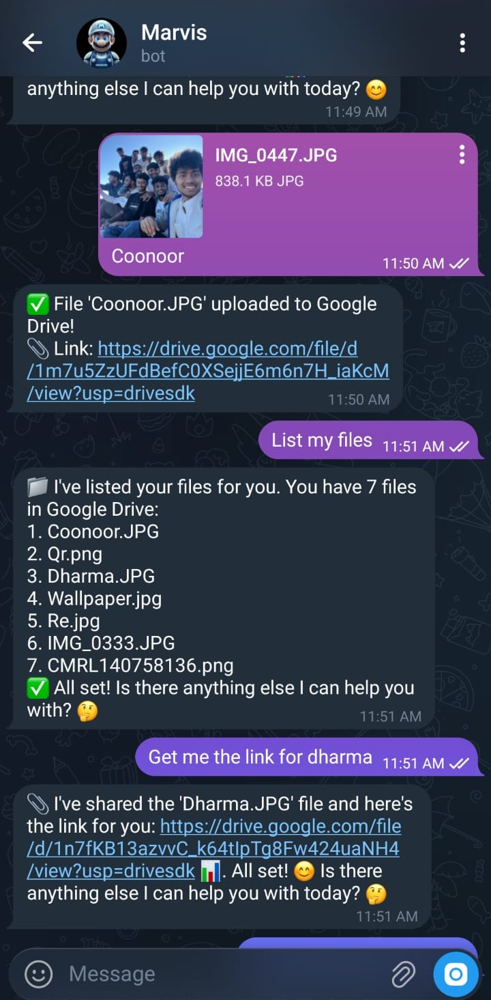
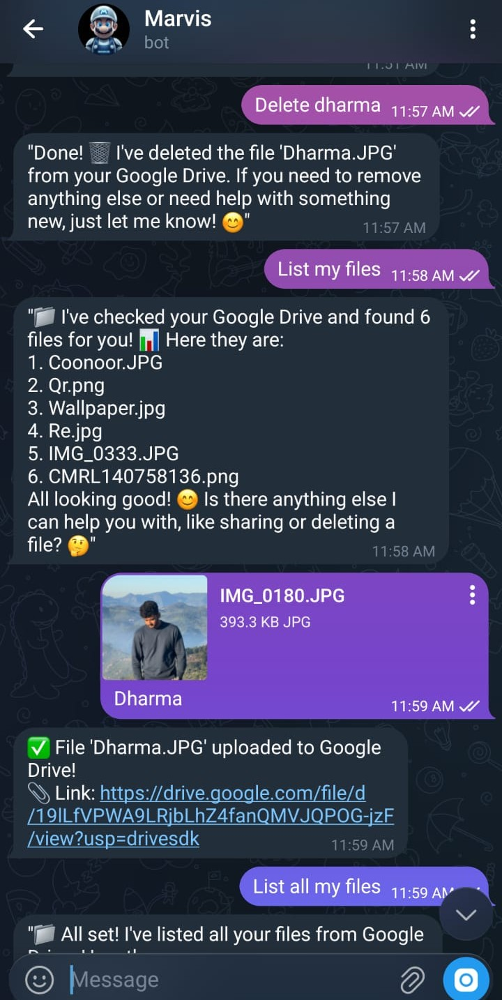

# Marvis — AI-Powered Google Drive Manager

An intelligent Telegram bot that manages your **Google Drive files**  through natural conversation. Powered by Groq's Llama 3.3 70B and built with an autonomous MCP (Model Context Protocol) agent architecture.

## 📸 Screenshots

<p align="center">
  
  &nbsp;&nbsp;
  
</p>

## 🌟 Features

### 📁 Google Drive Management
- **Upload files** — Send any document via Telegram and it's stored in your Drive with a custom name
- **List files** — View all your Drive files instantly
- **Get shareable links** — Ask for a link by file name and get a public Drive URL
- **Share files** — Share a file with anyone by email (viewer / commenter / editor)
- **Delete files** — Remove files from Drive by name

- Natural language intent classification routes every message to the correct MCP
- No slash commands needed — just talk naturally
- Context-aware entity extraction (file names, dates, emails)
- LLM-enhanced understanding with robust JSON parsing

---

## 🚀 Quick Start

### Prerequisites

- Python 3.10+
- Telegram Bot Token (from [@BotFather](https://t.me/BotFather))
- [Groq API Key](https://console.groq.com/)
- Google Cloud project with **Drive API** and **Calendar API** enabled

### Installation

```bash
# Clone
git clone https://github.com/Dharmendra-nkr/Agentic-ai-Telebot.git
cd Agentic-ai-Telebot

# Virtual environment
python -m venv venv
venv\Scripts\activate        # Windows
# source venv/bin/activate   # Linux/Mac

# Dependencies
pip install -r requirements.txt
```

### Configuration

Create a `.env` file in the project root:

```env
TELEGRAM_BOT_TOKEN=your_telegram_bot_token
GROQ_API_KEY=your_groq_api_key
ALLOWED_USER_IDS=your_telegram_user_id

# Google Drive
GOOGLE_DRIVE_CREDENTIALS_FILE=credentials/google_drive_credentials.json
GOOGLE_DRIVE_ENABLED=true

# Google Calendar
GOOGLE_CREDENTIALS_FILE=credentials/google_credentials.json
```

### Google Drive Authentication

1. Create an OAuth 2.0 Client ID in [Google Cloud Console](https://console.cloud.google.com/)
2. Download the client secrets JSON → save as `credentials/google_drive_credentials.json`
3. Run the auth flow:

```bash
python auth_drive.py
```

This opens a browser for OAuth consent. After completion, a token is saved at `credentials/drive_token.pickle`.

### Run

```bash
python main.py
```

---

## 📖 Usage Examples

### Google Drive
```
"List my files"
"Get the link for report.pdf"
"Share resume.pdf with john@gmail.com"
"Delete notes.txt"
```
``

### File Upload
Send any document to the bot via Telegram. Add a **caption** to name the file:
> 📎 Attach `screenshot.png` with caption **"Project Screenshot"**
> → Uploaded as `Project Screenshot.png` to Google Drive

---

## 🏗️ Architecture

```
├── agent/
│   ├── orchestrator.py   # Message → intent → plan → execute → respond
│   ├── planner.py        # Intent analysis, entity extraction, execution plans
│   ├── executor.py       # Routes plans to the correct MCP
│   └── prompts.py        # LLM system/classification/extraction prompts
├── mcps/
│   ├── base.py           # BaseMCP abstract class
│   ├── file_storage_mcp.py   # Google Drive (upload, list, link, share, delete)
│   ├── calendar_mcp.py       # Google Calendar (create, list events)
│   ├── reminder_mcp.py       # Reminders (create, list, trigger)
│   └── registry.py           # MCP registration & discovery
├── memory/               # Short-term, long-term, and temporal memory
├── scheduler/            # APScheduler for reminder notifications
├── telegram_bot/
│   ├── bot.py            # Telegram handlers (text + document upload)
│   └── notifications.py  # Push notifications
├── utils/
│   ├── nlp.py            # Intent keywords, datetime parsing
│   └── logger.py         # Structured logging
├── credentials/          # OAuth tokens & client secrets (git-ignored)
├── auth_drive.py         # Google Drive OAuth setup script
├── auth_google.py        # Google Calendar OAuth setup script
├── config.py             # Settings from .env
├── main.py               # Entry point (FastAPI + Telegram polling)
└── requirements.txt
```

### How It Works

```
User message
  → Telegram Bot receives text or document
  → Orchestrator.process_message()
    → Planner.analyze_message()    — rule-based NLP + LLM entity extraction
    → Planner.create_plan()        — maps intent → MCP execution steps
    → Executor.execute_plan()      — calls the right MCP
    → Orchestrator._generate_response()  — LLM formats the reply
  → Response sent back via Telegram
```

---

## 🛠️ Tech Stack

| Layer | Technology |
|-------|-----------|
| **LLM** | Groq — Llama 3.3 70B Versatile |
| **Bot** | python-telegram-bot |
| **API** | FastAPI + Uvicorn |
| **Drive** | Google Drive API v3 (OAuth 2.0) |
| **Calendar** | Google Calendar API v3 |
| **Database** | SQLite + SQLAlchemy |
| **Scheduler** | APScheduler |
| **NLP** | dateparser, python-dateutil |
| **Logging** | structlog |

## 🔐 Security

- All secrets loaded from environment variables
- OAuth tokens stored as pickle files (git-ignored)
- Telegram user ID whitelist for access control
- Google Cloud app in Testing mode with explicit test users

## 📝 License

MIT License

## 👨‍💻 Author

**Dharmendra**

## 🤝 Contributing

Contributions are welcome! Please feel free to submit a Pull Request.

## 📧 Support

For issues and questions, please open an issue on GitHub.
